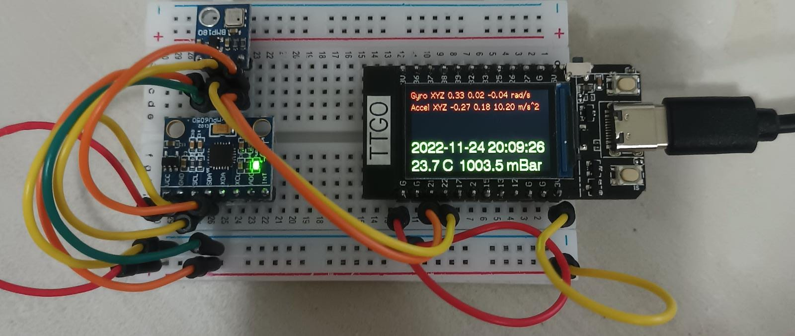

# ESP32-TTGO

ARDUINO ESP32 mit TTGO color LCD 135x240 Display 
https://www.aliexpress.com/item/1005003745502352.html

Das habe ich mal zum Test zusammen kopiert. Aber heilige Scheisse, die Arduino IDE ist müll, mehr als ein Blinklicht will man da nicht mit machen.

# Ubuntu Anleitung
#ARDUINO IDE 2.0.2 mit TTGO ESP32 Display :1.14 inch color LCD 135x240 display  
#https://www.aliexpress.com/item/1005003745502352.html  
#Arduino Linux Serial Permissions  
Run dmesg to determine idVendor and idProduct of the USB interfaces (in this case there are two.)  
Use sudo and your favorite editor to create a file: “/etc/udev/rules.d/50-myusb.rules”  
Using the idVendor and idProduct numbers, create two lines in the file using this format (replacing the numbers shown with your numbers):  
SUBSYSTEMS==“usb”, ATTRS{idVendor}==“2e8a”, ATTRS{idProduct}==“0004”, GROUP=“plugdev”, MODE=“0660”, TAG+=“uaccess”  
Save and close the file then restart your system.  
#kleiner Fehler beheben  
#"exec: "python": executable file not found in $PATH  
#Error compiling for board ESP32 Wrover Module"   
sudo ln -s /usr/bin/python3 /usr/bin/python  
#Arduino download  
wget https://downloads.arduino.cc/arduino-ide/arduino-ide_2.0.3_Linux_64bit.AppImage  
mv arduino-ide_2.0.3_Linux_64bit.AppImage ~/Schreibtisch  
chmod u+x ~/Schreibtisch/arduino-ide_2.0.3_Linux_64bit.AppImage  
#Starten im Terminal im hintergrund  
~/Schreibtisch/arduino-ide_2.0.3_Linux_64bit.AppImage & disown  
#Einstellungen  
Menü -> File -> Preferences -> Language -> English  
Menü -> File -> Preferences -> Show verbose output during compile und upload -> check  
Menü -> File -> Preferences -> Compiler warnings -> Default  
Menü -> File -> Preferences -> Additional URLs -> https://dl.espressif.com/dl/package_esp32_index.json  
Menü -> File -> Preferences -> OK  
Libary Manager -> TFT_eSPI -> Suchen und Installieren -> "TFT_eSPI by Bodmer"  
Bords Manager -> ESP32 suchen und esp32 by Espressif Sytems instalieren  
Tools -> Board -> esp32 -> ESP32 Dev Modul auswählen  
Tools -> Port -> /dev/ttyACM0 auswählen -> OK  
pluma ~/Arduino/libraries/TFT_eSPI/User_Setup_Select.h  
Zeile 30 #include <User_Setup.h>  mit // auskommentieren  
Zeile 61 #include <User_Setups/Setup25_TTGO_T_Display.h> "//" löschen und aktivieren  
Speichern  
#optional  
File -> Examples -> Examples from Custom Libary -> TFT_eSPI -> 160x128 -> TFT-Print_Test laden  
Compile und Upload -> BINGO  
#Weitere Libs installieren  
Libary Manager -> TFT_eSPI -> Suchen und Installieren  -> "Adafruit BMP085 Libary by Adafruit" -> INSTALL ALL   
Libary Manager -> TFT_eSPI -> Suchen und Installieren  -> "Adafruit MPU6050 by Adafruit" -> INSTALL ALL  
Libary Manager -> TFT_eSPI -> Suchen und Installieren  -> "NTPClient by Fabrice Weinberg" -> INSTALL ALL  
